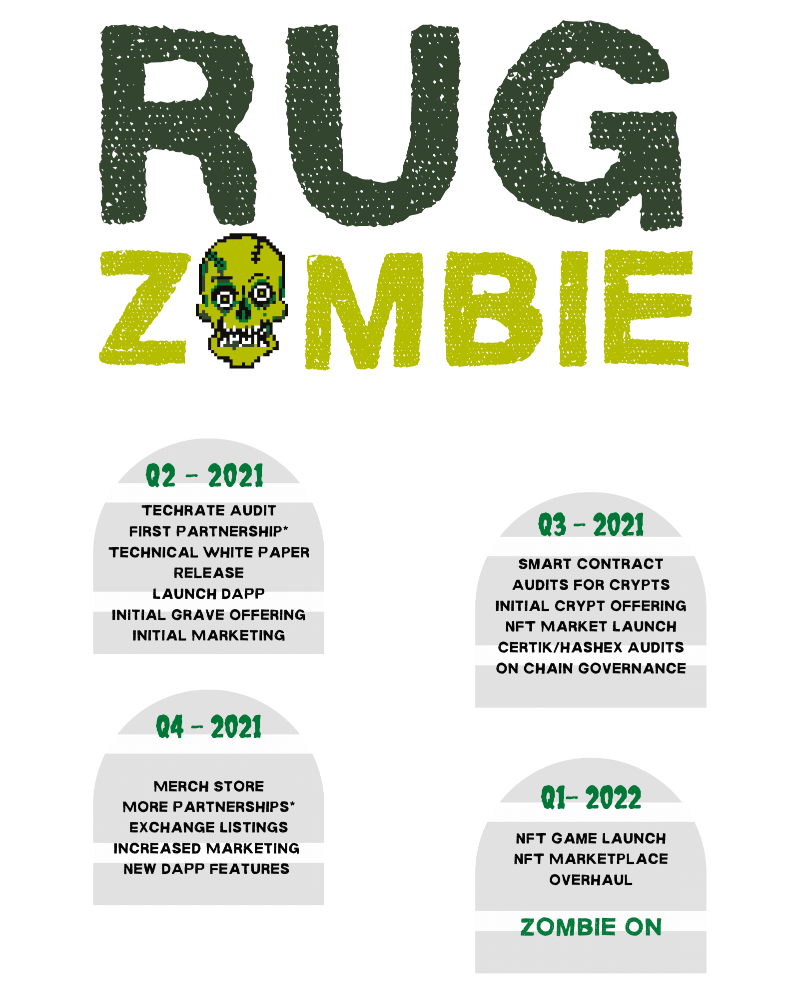

# $ZMBE Roadmap



* [ ] Techrate Audit
* [ ] First Partnerships\*
* [ ]  Lite Paper Release
* [ ] Launch of Dapp
* [ ] Initial Grave, Tomb and Spawning Pool Offerings
* [ ] Initial Marketing



* [ ] Smart Contract Audits for Spawning Pools
* [ ] Secondary Wave of Grave, Tomb and Spawning Pools Offerings
* [ ] Certik/Hashex Audits
* [ ] Own AMM\* 
* [ ] Community Voting Features
* [ ] NFT Showroom Launch
* [ ] Merch Store



* [ ] Merch Store Updates
* [ ] More Partnerships\*
* [ ] Exchange Listings
* [ ] New DAPP Features \(in development\)
* [ ] Increased Marketing



* [ ] NFT Market Overhaul 
* [ ] Secondary Market\*
* [ ] NFT Game Ecosystem Launch
* [ ] First Game Launch
* [ ] Charitable Giving & Promotional Events





