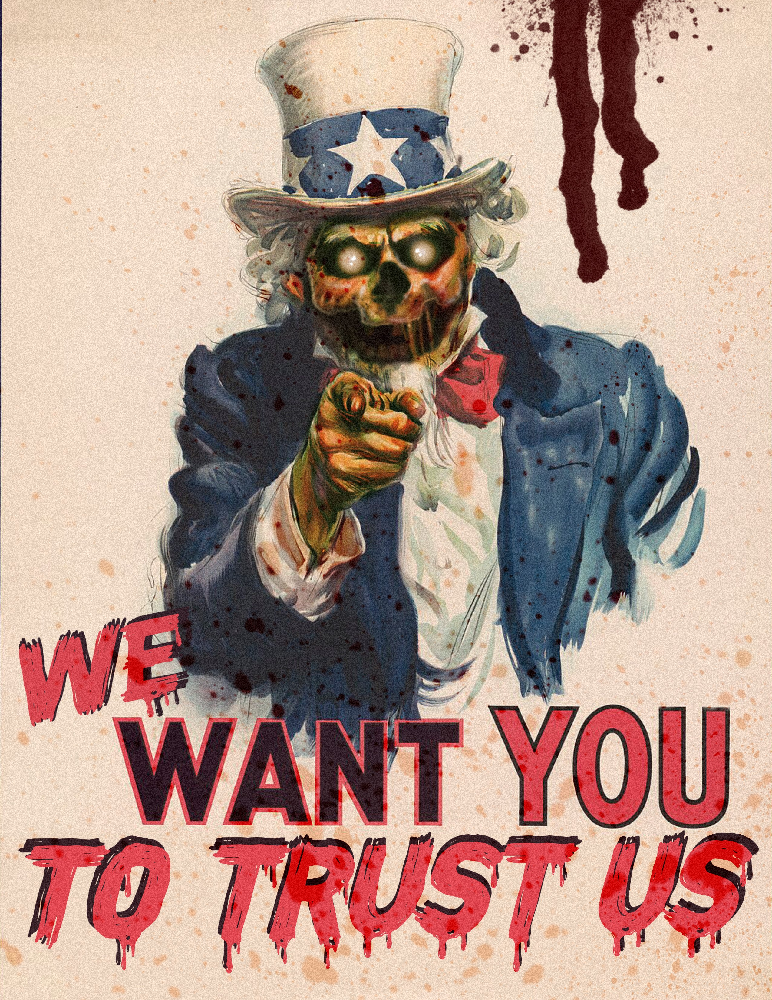

# TRUST US CAMPAIGN (complete)

The RugZombie is committed to earning the trust of our users. DeFi can be a hellish landscape for new projects. There are so many variables, and often development is pitted against community perception.&#x20;

In August of 2021, The RugZombie team committed to an overhaul of transparency, trust and security related matters for our team and platform including a campaign that includes:&#x20;

* [x] Locking Our Migrator Code with a Custom SafeOwner Code
* [x] KYC for our core founders with an outside firm (EZ confirmed with a news outlet before publication)&#x20;
* [x] KYC for all contract devs on our platform utilizing [blockpass](https://blockpass.org)
* [x] [Time-locked Master-Chef](basic-team-security-information/)
* [x] Increased Visibility through AMAs, etc.
* [x] Some interesting [MAUSOLEUM](../basic-information/main-features/mausoleum.md) pieces to celebrate our progress
* [x] Application for a Second Audit ([AUDIT COMPLETED: VIEW HERE](https://rugzombie.gitbook.io/docs/security-and-team-information/basic-team-security-information/audits))
* [x] Some Sponsored Press through trusted media outlets about our project

We hope these efforts will further offer our current and future users trust on our platform. We take pride in being transparent (if not a bit irreverent) regarding our platform.

&#x20;\*locked LP is not possible to maintain our commitment to 75% of our LP committed to apeswap.&#x20;
