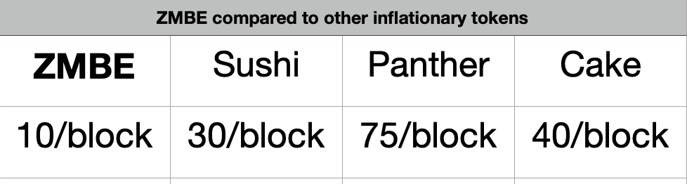

# Burning Mechanisms and Inflation Control

**1. Low Block Emission**

By beginning our contract  with a low block emission of $ZMBE generated per block, we can slow the inflation. Our emission rate is incredibly low \(10 $ZMBE per block\) compared to other similar projects with yield farming contracts \(see the figure below\). We don't want lower or raise the emission too frequently, too early, for the same reason we don't want a hard cap: we still need to incentivize people to provide liquidity. We will update our community about the emission rates as the project develops. 

**2. Manual Buy Back and Burn Features**

The dev team is committed to buying back and burning $ZMBE as we hit certain milestones as a community. We chose not to automate this process completely but instead to allow for manual adjustment to emissions and burns to adapt to changing environment in crypto. 

**3. Unlock Fees for Graves, Tombs, and Spawning Pool**

With the unlock of each [grave, tomb or spawning pool,](../basic-information/main-features/) a portion of the unlock fee will go to buy back and burn automatically. We understand that paying a deposit fee can be avoided on other platforms that have their own AMM and are discussing plans to move toward our own AMM in the future. 

For now, you can view the deposit fee as payment for the custom NFT that you receive in our graves. :-\) It also decreases the $ZMBE supply therefore supporting the price of $ZMBE longterm.

**4. Future Features and Burning Elements**

Stay tuned, we have a lot of ideas to keep the ZMBE supply low, with a goal of becoming **emission neutral**.

