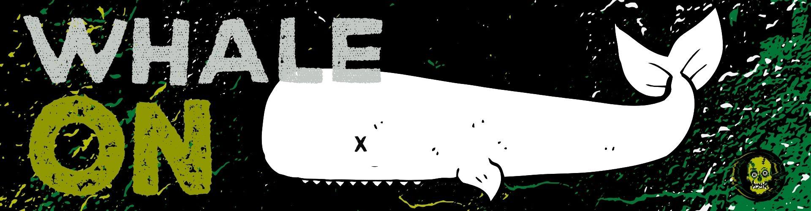

# Whale Games

## Whale Tax on LP Removal

Whether a project starts with a presale or a fair launch, BSC projects can fall prey to large wallet holders who can drastically affect price action on the open market. This is a short term issue that is nearly unavoidable on new tokens. While we are a long term project (and not worried about short term price action) we are mindful that the first weeks and months of a new project are extremely important for its success.

Our team was thoughtful about balancing the fair and open nature of a decentralized financial market with restricting major market manipulation by whales. 

Rather than restricting whales completely (who can bring much needed liquidity to the market), we have chosen instead to apply a whale tax of 8% on liquidity removal of more than 5% of the total supply from TOMBS. 

This 8% will be immediately be sent to a multi-signature address where we can buy back and burn our token, lock liquidity or migrate to our own AMM.

As our market matures, we may need to change the tax rate, so please stay updated on the most relevant information. 

Please note this whale tax is hardcoded into the contract of our TOMBS and therefore will trigger even in event of emergency withdrawal.

## De-Incentives

In addition to our whale tax, all graves and tombs have an early withdraw fee of 5% for withdrawing deposits prematurely.

This timer resets whenever any amount of $ZMBE is removed from Graves and Tombs, thereby reducing the frequency of removing LP. This additionally de-incentivizes whales from removing just below the whale tax threshold in smaller amounts. This does not apply to harvesting features.

This early withdraw fee is [explained in depth here](early-withdraw-fees.md), and applies to all graves, tombs and spawning pools regardless of amount staked, so be mindful when entering and exiting our pools.

## Incentives - Whale Graves Coming Soon

Whales are not bad. There is a common misconception in the crypto-space that whales are only about manipulation. While whales have the ability to do that, we did not want to wholly de-incentivize them from our platform as many whales are good actors with a desire to promote adoption of cryptocurrency  projects. Whales provide needed liquidity and are crucial to long term success if they believe in the project and are willing to hold. 

We are creating a custom [GRAVE](../basic-information/main-features/graves/) for whales that employs a unique long term reward structure for whales who are acting in a positive, good faith manner. Rather than punish such people, we desired to incentivize good whale behavior. More details are coming soon for our Whale Graves. In the meantime, whale on.

